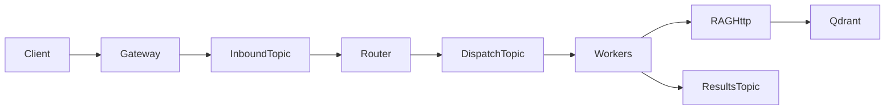

# Hermes · Kafka · 智谱多 Agent（Go + Python）

企业级样式的最小可运行骨架：**Go 网关**（Harness + JSON Schema + Kafka Produce）→ **Kafka（Redpanda）** → **Router（[Nous Hermes‑Agent](https://github.com/NousResearch/hermes-agent) 的 `AIAgent`，模型走智谱 OpenAI‑compat + `glm-*`）** 消费 **inbound** 并拆分 → 多条 **dispatch** 事件被 **workers**（`agent.copy` / `agent.research` / `rag.retrieve`）消费并把结果发到 **results**。**RAG** 使用 FastEmbed + Qdrant，并用 Cross‑Encoder rerank Top‑K（sentence‑transformers 可选加载）。

Router 使用上游包（见 `services/router/requirements.txt`，从 GitHub tag 钉死版本）；本地状态目录 **`.hermes_nous_home/`**（已 gitignore：`HERMES_HOME`）用于会话/缓存隔离。

### Router 与环境变量（智谱）

- `ZHIPU_API_KEY`：会在适配层同步为 Hermes 使用的 `ZAI_API_KEY` / `GLM_API_KEY`。
- `BIGMODEL_BASE_URL`：默认 `https://open.bigmodel.cn/api/paas/v4`。
- `HERMES_NOUS_MODEL`：默认 `glm-4-flash`（可按开放平台可用模型改名）。
- **`HERMES_ROUTER_MOCK`**：设为 `1` 或 `true` 时跳过 Nous/智谱推理，Router 固定拆分两条子任务，仅用于 **无 Key** 时打通 Kafka / Worker 联调。



## 1. 准备

1. Docker Desktop / Docker Engine。
2. Go ≥ 1.22、**Python ≥ 3.11**（Nous `hermes-agent` 硬性要求；Router venv 不可用系统自带的 3.10）。
3. 智谱开放平台 API Key：**若曾泄露请先轮换**。仅写入根目录 `.env`（永远不要提交）。
4. 复制环境变量：`cp .env.example .env` 后填写 `ZHIPU_API_KEY`。

## 2. Python 虚拟环境（三个独立 venv）

```bash
chmod +x scripts/*.sh scripts/*.py
./scripts/bootstrap_venvs.sh
```

## 3. 拉起基础设施（Redpanda + Redis + Qdrant）

```bash
./scripts/infra_up.sh
```

Kafka 对外开放端口默认 **`localhost:19092`**。

## 4. 运行顺序（五个终端）

| 序号 | 说明 | 命令 |
|-----|------|------|
| 1 | RAG FastAPI `:8090` | `source .env && ./scripts/run_rag.sh` |
| 2 | Router（消费 inbound，写入 dispatch） | `source .env && ./scripts/run_router.sh` |
| 3 | Workers（消费 dispatch，调用 RAG/`agent.*`） | `source .env && ./scripts/run_workers.sh` |
| 4 | Go 网关 `8080` | `cd gateway && set -a && source ../.env && set +a && go run ./cmd/gateway` |
| 5 | （可选）结果打印 | `source .env && .venv/workers/bin/python scripts/dump_recent_results.py` |

网关启动前请确保 **`TASK_SCHEMA_PATH`** 可被解析：`contracts/task-envelope.schema.json`（从 `gateway/` 目录运行时主程序会自动尝试上一级目录）。

### 向量库入库（Markdown + JSON metadata）

- 正文：**`markdown`**（兼容旧字段 **`text`**）；元数据：**`metadata`** 为任意 JSON 对象 → 存入 Qdrant **`payload`**，检索时在 **`context[].meta.metadata`** 回传。
- **`GET /internal/stats`**：点数统计。

```bash
source .env && .venv/rag/bin/python scripts/seed_rag_minimal.py
```

自测入库与检索：先起 Qdrant + RAG（`:8090`），再 **`.venv/rag/bin/python scripts/test_rag_markdown_save.py`**。

## 5. Smoke（仅验证网关写入 Kafka inbound）

在无智谱或无下游消费者时仍可验证 HTTP→Kafka：

```bash
./scripts/smoke_e2e.sh
```

随后在运行 Router / Workers / RAG 的终端查看日志或通过 `dump_recent_results.py` 抓取 `results` Topic JSON。

### curl 单次投递

```bash
curl -sS -X POST http://127.0.0.1:8080/api/v1/tasks \
  -H 'Content-Type: application/json' \
  -d '{"message":"写一个中文营销短句并进行事实核对"}' | jq
```

## 6. Harness 与设计要点

- **JSON Schema**：`contracts/task-envelope.schema.json`，Go 网关对入站/完整 envelope 做校验。
- **hop + MAX_HOPS**：超过阈值的生产者写 `TOPIC_TASKS_DLQ`，避免无休止协作。
- **Router**：[`nous_brain.py`](services/router/nous_brain.py) 挂载 Nous **[hermes-agent](https://github.com/NousResearch/hermes-agent)** 的 `AIAgent`（`enabled_toolsets=[]`，无工具、仅规划 JSON）；模型用 `HERMES_NOUS_MODEL`（默认 `glm-4-flash`）。
- **Workers**：含 `agent.copy` / `agent.research` / **`rag.retrieve`** / **`rag.ingest`**（`args.markdown` + `args.metadata` → `POST /internal/ingest`）。
- **RAG rerank**：若 `sentence-transformers`/PyTorch 不可用，仍返回向量检索但跳过重排。

## 7. Topic 前缀

默认值见 `.env.example`：`hermes.tasks.inbound`、`hermes.tasks.dispatch`、`hermes.tasks.results`、`hermes.tasks.dlq`。
